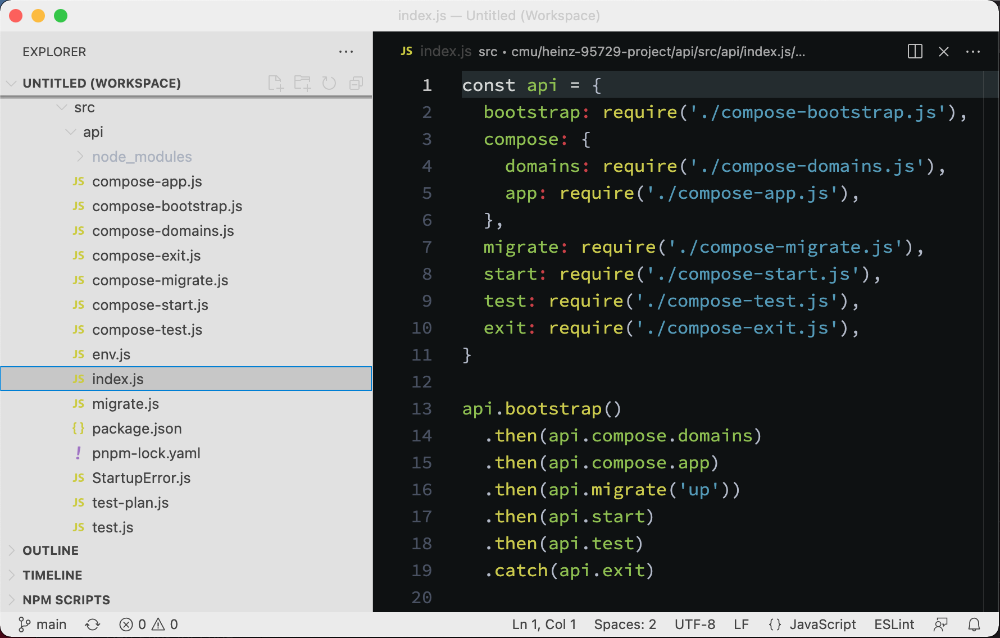
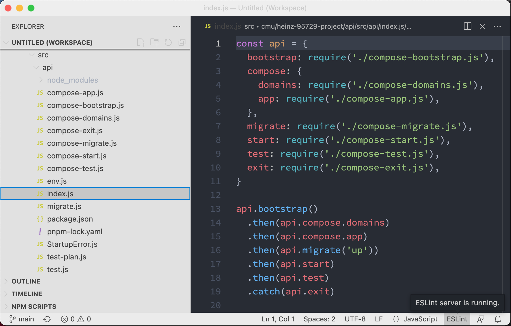
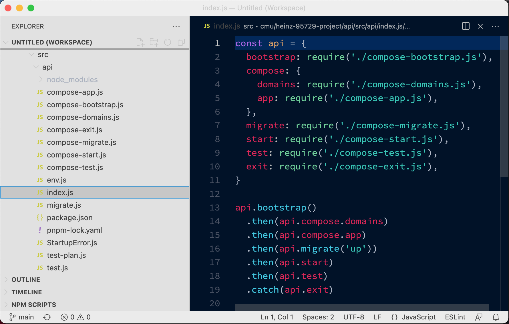
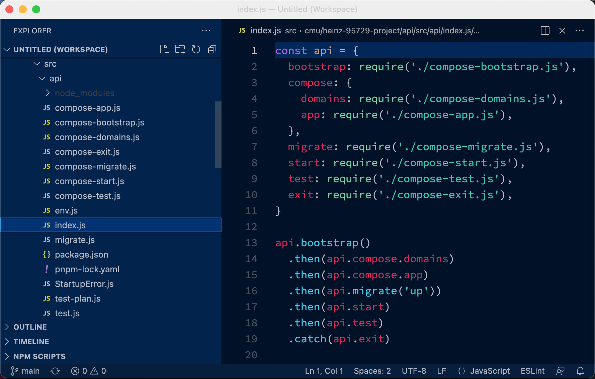
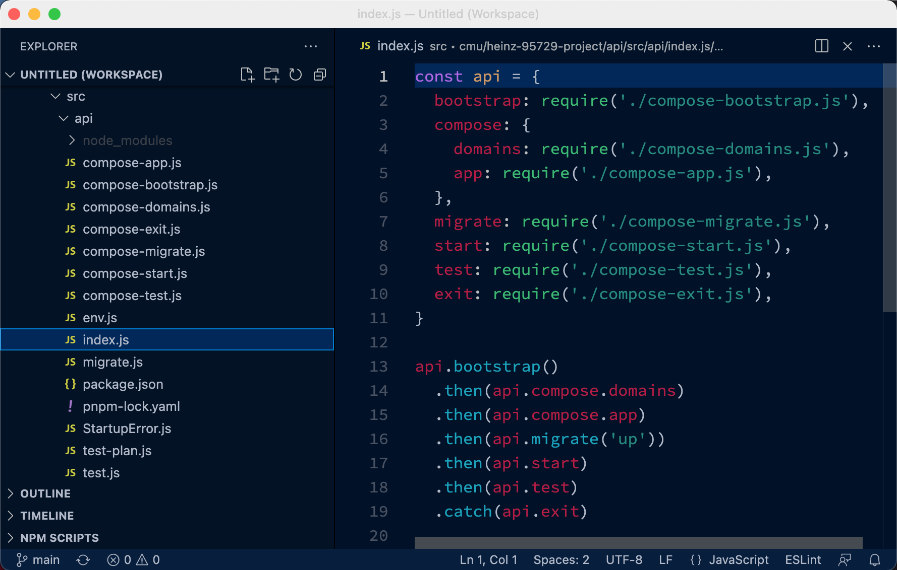
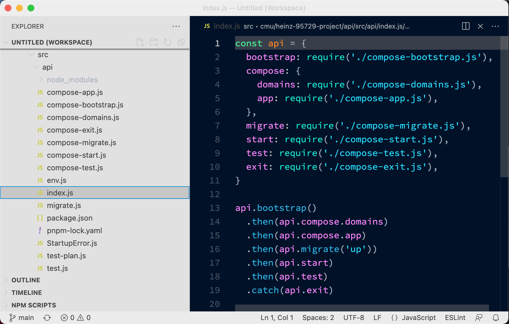

# Native UI Themes for VS Code

I really liked the [native-ui](https://github.com/fv0/native-ui) theme for Atom, so ported it to vscode. I never got it to a point where I felt it was worthy of publishing to VS Code extensions, so consider it _as-is_. It works well enough for me, although there are occasionally some contrast issues outside of the editor.


### Installing this locally

The following will build the themes, and copy them to `~/.vscode/extensions`.

```Shell
git clone
pnpm run buildAndCopy
# then restart VSCodep
```

### Removing this extension

The following will remove this extension from `~/.vscode/extensions`.

```Shell
pnpm run remove
# then restart VSCode
```

## The Themes

### Native UI - Seti



### Native UI - One Dark



### Native UI - geob0t



### Native UI - geob0t (Dark)



### Native UI - geob0t (Dim)

I like this one at night.



### Native UI - Decks

This one is high contrast. I like it for presentations.

